# 🛡️ SOC Automation & Incident Response Home Lab

> **Enterprise-grade Security Operations Center deployed on a local Linux host — featuring live Active Directory telemetry ingestion, multi-stage adversary simulation, automated SOAR playbook orchestration, and real-time MITRE ATT&CK coverage mapping.**

<div align="center">


</div>

---

## 📋 Table of Contents

- [Architecture Overview](#-architecture-overview)
- [Technology Stack](#-technology-stack)
- [Phase Deployment Runbook](#-phase-deployment-runbook)
- [SOAR Playbook Pipeline](#-soar-playbook-pipeline)
- [Adversary Kill-Chain Simulation](#-adversary-kill-chain-simulation)
- [Detection & Coverage Metrics](#-detection--coverage-metrics)
- [Infrastructure Challenges & Resolutions](#-infrastructure-challenges--resolutions)
- [Repository Structure](#-repository-structure)
- [Key Takeaways](#-professional-portfolio-takeaways)

---

## 🏗️ Architecture Overview

A software-defined, multi-tier SOC architecture running entirely on a single Linux host, segmented into isolated network zones using Docker bridge networking and KVM virtualization.

```
┌─────────────────────────────────────────────────────────────────┐
│                    HOST MACHINE (Pop!_OS Linux)                  │
│                                                                  │
│  ┌──────────────────────────────────────────────────────────┐   │
│  │              DEFENSIVE CORE  (Docker Bridge)             │   │
│  │                                                          │   │
│  │   [Wazuh Manager]──►[Wazuh Indexer]──►[Dashboard]       │   │
│  │         │                                                │   │
│  │         ▼                                                │   │
│  │   [Shuffle SOAR]──►[TheHive 5]──►[Cortex 3]             │   │
│  │         │                   │            │               │   │
│  │         │              [Cases]    [VirusTotal API]       │   │
│  │         ▼                                                │   │
│  │   [Webhook Trigger]──►[Parse]──►[Filter L≥12]──►[Alert] │   │
│  └──────────────────────────────────────────────────────────┘   │
│                                                                  │
│  ┌──────────────────────────────────────────────────────────┐   │
│  │           MONITORED ASSET NETWORK  (QEMU/KVM)            │   │
│  │                                                          │   │
│  │   [Windows Server 2022 DC01]                             │   │
│  │     ├── Wazuh Agent (MSI)                                │   │
│  │     ├── Sysmon (Advanced Audit Logging)                  │   │
│  │     ├── GPO (Process + CLI Logging)                      │   │
│  │     └── Atomic Red Team (Adversary Simulation)           │   │
│  └──────────────────────────────────────────────────────────┘   │
└─────────────────────────────────────────────────────────────────┘
```

---

## 🧰 Technology Stack

| Layer | Technology | Role |
|---|---|---|
| **SIEM** | Wazuh 4.14.5 | Log ingestion, rule engine, vulnerability detection |
| **SOAR** | Shuffle (Docker Swarm) | Automated playbook orchestration |
| **Case Management** | TheHive 5 | Incident lifecycle & analyst workflow |
| **Threat Intelligence** | Cortex 3 + VirusTotal | Automated IOC enrichment |
| **Target Environment** | Windows Server 2022 (KVM) | Active Directory DC under monitoring |
| **Agent** | Wazuh Agent (MSI) | Endpoint telemetry forwarding |
| **Simulation** | Atomic Red Team | MITRE ATT&CK adversary emulation |
| **Containerization** | Docker Compose + Swarm | Service orchestration |
| **Host OS** | Pop!_OS Linux | Hypervisor + container host |

---

## 🚀 Phase Deployment Runbook

### Phase 1 — SIEM Deployment

- Deployed Wazuh single-node stack (Manager + Indexer + Dashboard) via Docker Compose over an isolated bridge network
- Validated live cluster health via the Wazuh Dashboard web interface
- Configured OpenSearch index patterns and alert thresholds

The Wazuh rules engine loaded **4,512 active detection rules** across syslog, firewall, IDS, Windows, and custom rule categories:

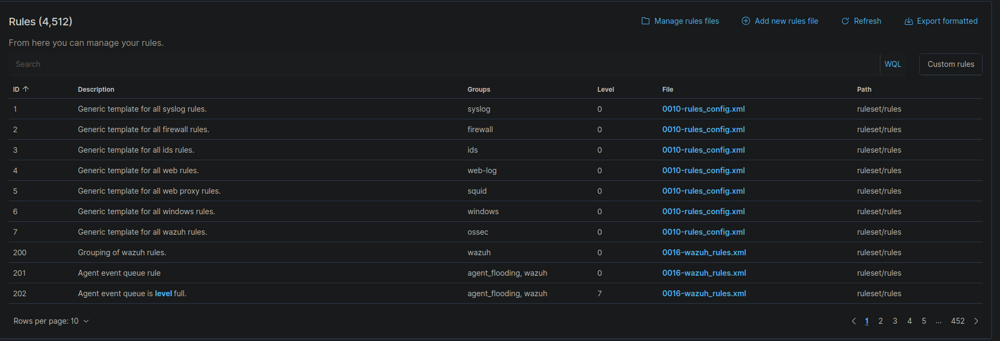

---

### Phase 2 — SOAR & Automation Integration

- Deployed Shuffle SOAR alongside TheHive 5 and Cortex 3
- Resolved Docker Swarm initialization issues on a single-node host:

```bash
docker swarm init --advertise-addr 127.0.0.1
```

- Provisioned Cortex analyzers with VirusTotal API integration under the `SOC-Lab` organization:

```yaml
command:
  - --cql-hostnames=cassandra
  - --es-hostnames=elasticsearch
  - --cortex-hostnames=cortex
  - --cortex-keys="cortex:dvT+cvNuLVoTvlQI6F4ZclShMs+Y1iH1"
```

**Cortex 3 — Active `SOC-Lab` organization provisioned with VirusTotal analyzer access:**

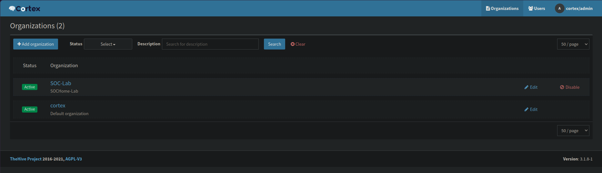

**TheHive 5 — `SOC-Lab` tenant active and linked to Cortex for automated case enrichment:**

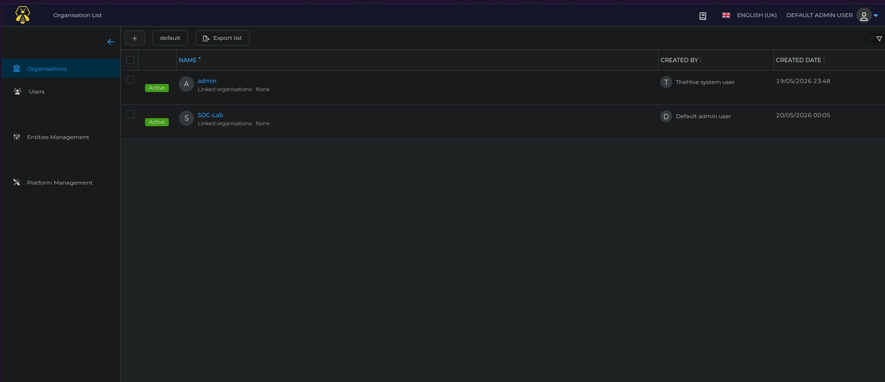

---

### Phase 3 — Active Directory Telemetry Pipeline

- Deployed Windows Server 2022 as primary Domain Controller (`DC01`) under QEMU/KVM
- Installed Wazuh Agent (MSI) for live endpoint telemetry forwarding to Wazuh Manager
- Hardened GPO audit policy to capture:
  - Process Execution events
  - Command-line argument strings
  - PowerShell ScriptBlock logging

---

### Phase 4 — Detection Rule Engineering

Custom Sysmon-based Wazuh rule targeting unauthorized LSASS memory access:

```xml
<group name="windows,sysmon,credential_access">
  <rule id="100200" level="12">
    <if_sid>61600</if_sid>
    <field name="win.eventdata.targetImage">\\lsass.exe</field>
    <field name="win.eventdata.grantedAccess">0x1010</field>
    <description>CRITICAL: Unauthorized LSASS Memory Dump Attempt on DC01</description>
    <mitre>
      <id>T1003.001</id>
    </mitre>
  </rule>
</group>
```

Custom rule `100001` fires at Level 12 on brute-force authentication attempts against the Administrator account from external IPs, mapped to MITRE T1110 (Credential Access):

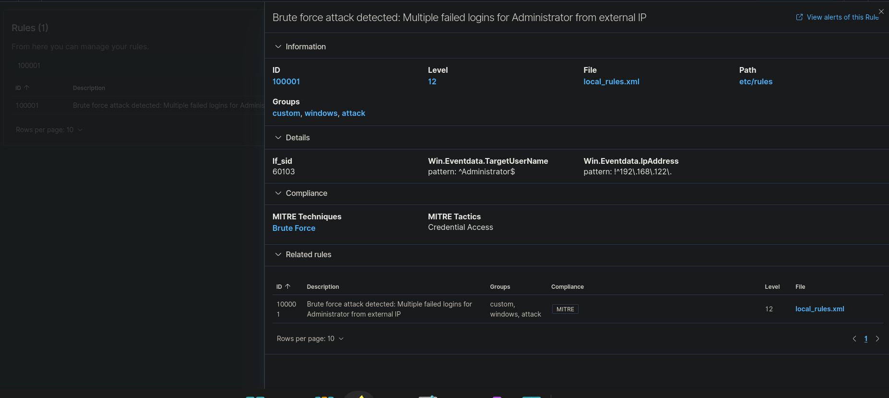

---

### Phase 5 — File Integrity Monitoring (FIM)

Real-time FIM configured on high-value Windows directories:

```xml
<directories check_all="yes" realtime="yes">C:\Users\Administrator\Desktop</directories>
<directories check_all="yes" realtime="yes">C:\Windows\System32\drivers\etc</directories>
```

The FIM engine captured **15 registry integrity events** on `DC01` in real time — flagging checksum changes to `HKLM\System\CurrentControlSet` keys triggered during adversary simulation:

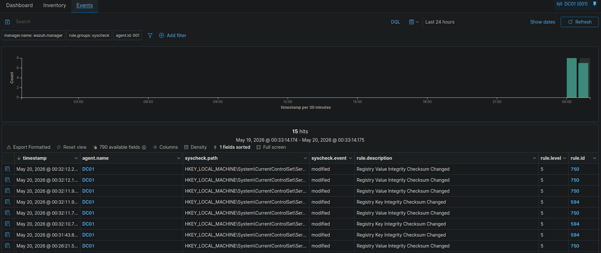

Resolved container permission errors on rule directories:

```bash
sudo docker exec -it single-node_wazuh.manager_1 chown -R 952:952 /var/ossec/etc/rules/
```

---

### Phase 6 — Vulnerability Discovery

- Armed Wazuh Vulnerability Detector for continuous CVE scanning against the DC01 endpoint
- **1,529 vulnerability inventory hits** on Microsoft Windows Server 2022 Standard (`10.0.20348.587`)
- Severity breakdown includes Critical, High, and Medium findings — heap-based buffer overflows, use-after-free in TCP/IP and Hyper-V, and authentication bypass vulnerabilities

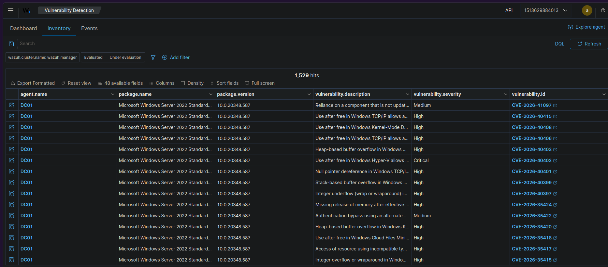

| CVE ID | Severity | Description |
|---|---|---|
| `CVE-2026-40402` | **Critical** | Use after free in Windows Hyper-V |
| `CVE-2026-40415` | High | Use after free in Windows TCP/IP |
| `CVE-2026-40408` | High | Use after free in Windows Kernel-Mode Driver |
| `CVE-2026-35422` | Medium | Authentication bypass via alternate path |

---

## ⚙️ SOAR Playbook Pipeline

Automated alert triage workflow triggered by Wazuh webhooks:

```
[Wazuh Alert] ──► [Shuffle Webhook] ──► [Parse JSON] ──► [Filter: Level ≥ 12]
                                                                    │
                                              ┌─────────────────────┘
                                              ▼
                                   [HTTP POST → Ticket Sim]
                                              │
                                              ▼
                                   [HTTP POST → Wazuh API]
```

### 🧩 Visual Playbook Workflow Mapping
The active workflow orchestration graph configured inside the Shuffle editor:

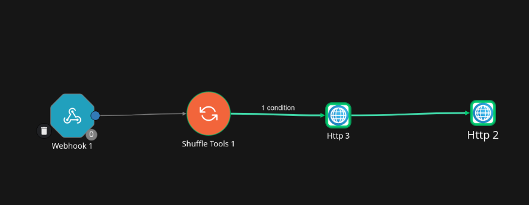

**Pipeline resolved issues documented:**

| Problem | Root Cause | Fix |
|---|---|---|
| `0 + 0 = 2` execution loop | Docker Swarm not initialized | `docker swarm init` |
| Environment mismatch | `ENVIRONMENT_NAME=Shuffle` vs node `onprem` | Aligned `.env` variable |
| Worker dispatch timeout | `shuffle_swarm_executions` network missing | Swarm init creates it automatically |
| Condition always false | Path `$shuffle_tools_1.level` missing `.rule` | Corrected to `$shuffle_tools_1.rule.level` |
| `405 Method Not Allowed` | `/manager/logs` is GET-only | Switched to `/events` POST endpoint |

**Test payload:**

```bash
curl -k -X POST http://localhost:3001/api/v1/hooks/webhook_<your_id> \
  -H "Content-Type: application/json" \
  -d '{
    "timestamp": "2026-05-19T16:45:00.000+0000",
    "rule": {
      "level": 12,
      "description": "Atomic Red Team: LSASS Credential Dumping Detected",
      "id": "100001"
    },
    "agent": { "id": "001", "name": "DC01" }
  }'
```

---

## 🪓 Adversary Kill-Chain Simulation

Full multi-stage attack sequence executed via Atomic Red Team on `DC01`, covering four MITRE ATT&CK techniques across Discovery, Execution, Credential Access, and Persistence:

```powershell
Import-Module "C:\AtomicRedTeam\invoke-atomicredteam\Invoke-AtomicRedTeam.psd1" -Force

# T1083 — File & Directory Discovery
Invoke-AtomicTest T1083 -TestNumbers 1

# T1059.001 — PowerShell Execution via Mimikatz
Invoke-AtomicTest T1059.001 -TestNumbers 1

# T1003.001 — LSASS Memory Dump via ProcDump
Invoke-AtomicTest T1003.001 -TestNumbers 1

# T1110 — Brute Force Authentication (10 attempts)
for ($i=1; $i -le 10; $i++) {
    net use \\localhost\IPC$ /user:Administrator "WrongPassword$i" 2>$null
}
```

**Live execution terminal on DC01 — all four attack stages completed successfully:**

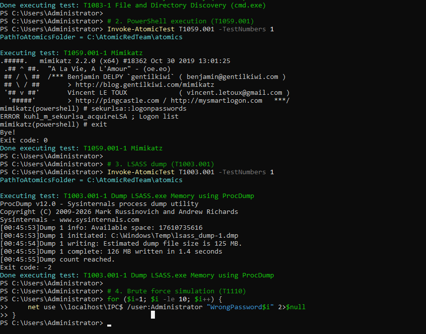

Key forensic artifacts captured:
- **Mimikatz 2.2.0** executed via T1059.001, attempting `sekurlsa::logonpasswords` against LSASS
- **ProcDump v12.0** wrote a **126 MB** raw LSASS memory image to `C:\Windows\Temp\lsass_dump-1.dmp` in 1.4 seconds
- **10 sequential brute-force SMB authentication attempts** against Administrator

---

## 📊 Detection & Coverage Metrics

### MITRE ATT&CK Coverage Summary

| MITRE Technique | Tactic | Rule Triggered | Severity | Result |
|---|---|---|---|---|
| T1110 | Credential Access | Rule 60204 | Level 10 | ✅ Detected |
| T1003.001 | Credential Access | Rule 100200 (Custom) | Level 12 | ✅ Detected |
| T1059.001 | Execution | Rules 92032 / 92052 | Level 3–4 | ✅ Detected |
| T1083 | Discovery | Rule 92031 | Level 3 | ✅ Detected |
| T1567 | Exfiltration | Rule 92037 | Level 3 | ✅ Detected |
| T1078 | Defense Evasion / Persistence | Rule 60106 | Level 3 | ✅ Detected |

**Full dashboard showing 995 total events with 1 Level-12 critical alert, 30 authentication failures:**

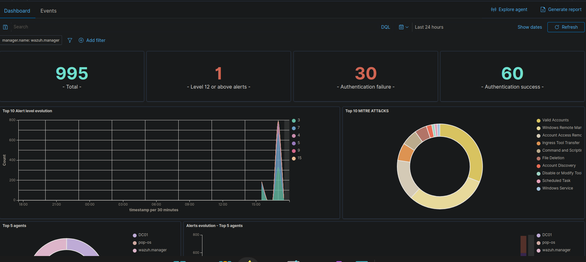

**MITRE ATT&CK tactic coverage map — Defense Evasion, Privilege Escalation, Persistence, Initial Access, Execution, C2, Impact, Lateral Movement, Discovery, and Exfiltration all covered:**

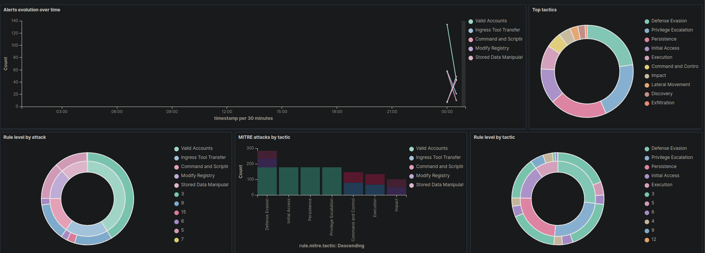

**579 raw MITRE-tagged events from DC01 — T1567 (Exfiltration via PowerShell net.exe), T1110 (Credential Access), T1531 (Impact) visible in the stream:**

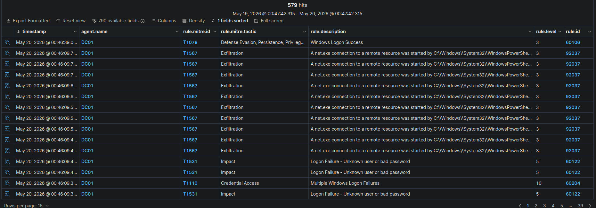

---

### Authentication & Brute Force Detection

**30 authentication failures with zero successful logins — brute force pattern confirmed and isolated to DC01:**

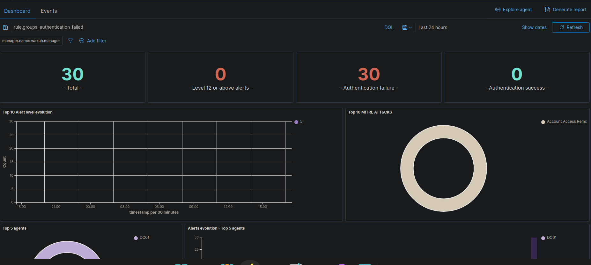

---

### Sysmon Threat Hunting

The Sysmon integration surfaced **26 advanced host telemetry events** not captured by standard Windows logging — including scheduled task DLL loading (`taskschd.dll`), PowerShell scripting file drops into Temp directories, and discovery enumeration sequences:

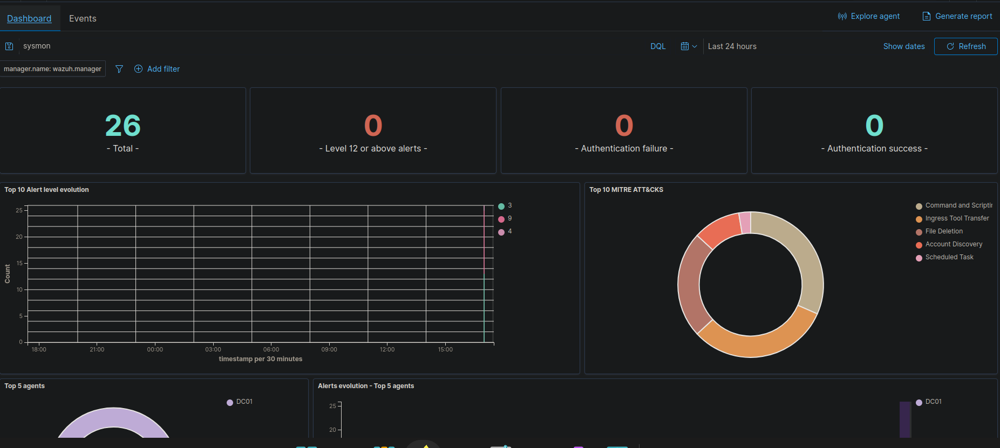

**Raw Sysmon event detail — PowerShell writing scripting files to `%TEMP%`, DLL injection into `taskschd`, and discovery activity fired by Atomic Red Team across DC01:**

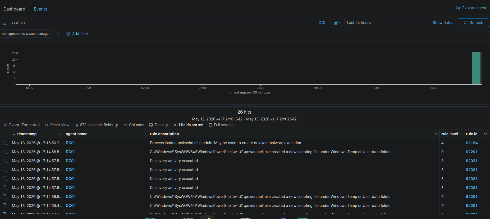

**T1059.003 (Windows Command Shell) — `cmd.exe` spawned by an abnormal parent process on DC01, captured by Rules 92032 and 92052:**

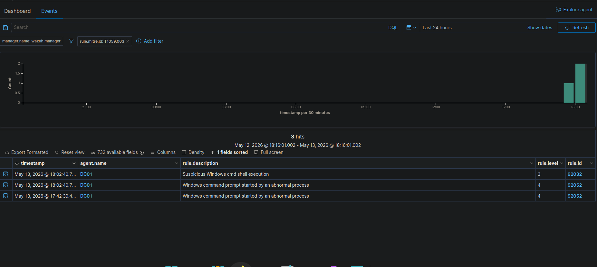

---

### Network Layer — Suricata IDS Integration

Suricata alerts ingested directly by Wazuh via Rule 86601, flagging **STREAM excessive TCP retransmission events** from the Pop!_OS host during the adversary simulation phase:

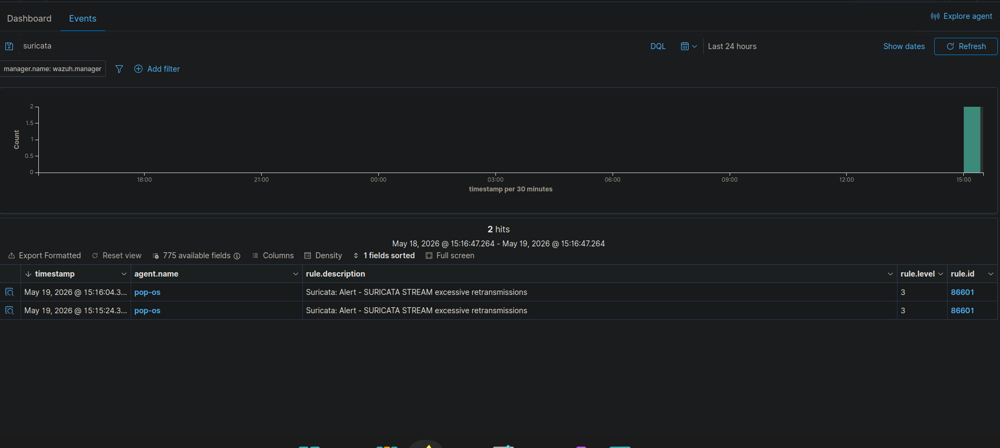

---

## 🔧 Infrastructure Challenges & Resolutions

<details>
<summary><strong>Issue 1: Shuffle SOAR — Persistent <code>0 + 0 = 2</code> execution loop</strong></summary>

**Symptom:** Webhook returned `success: true` with valid `execution_id` but executions never progressed.

**Root Cause:** Multiple layered issues —
1. `ENVIRONMENT_NAME=Shuffle` in `.env` didn't match webhook node's `onprem` setting
2. Docker Swarm was never initialized, so `shuffle_swarm_executions` network couldn't be created
3. Worker containers couldn't spawn without the swarm execution network

**Resolution:**
```bash
docker swarm init --advertise-addr 127.0.0.1
# Then add to .env:
SHUFFLE_DOCKER_NETWORK=shuffle_shuffle
```
</details>

<details>
<summary><strong>Issue 2: Shuffle Tools node — <code>unhashable type: dict</code> error</strong></summary>

**Symptom:** `TypeError: unhashable type: 'dict'` on Shuffle Tools node execution.

**Root Cause:** Stale cached app definition in the local worker image incompatible with newer worker runtime.

**Resolution:** Delete and re-add the Shuffle Tools node from scratch; re-map variables using the UI autocomplete instead of manual entry.
</details>

<details>
<summary><strong>Issue 3: Condition node always evaluating false</strong></summary>

**Symptom:** HTTP nodes downstream always showed `SKIPPED` with `"Total: 0 of 1"`.

**Root Cause:** Condition source path was `$shuffle_tools_1.level` — missing the intermediate `.rule` key since Wazuh payloads nest level under `rule.level`.

**Resolution:** Corrected path to `$shuffle_tools_1.rule.level` via UI autocomplete. Used `larger than 11` as proxy for `>= 12` since Shuffle has no `>=` operator.
</details>

<details>
<summary><strong>Issue 4: Wazuh FIM — <code>ERR_BAD_REQUEST</code> on rule directory</strong></summary>

**Symptom:** Wazuh Manager threw permission errors when reading custom rules.

**Root Cause:** Container volume mount ownership mismatch — rule files were owned by host user instead of the Wazuh process UID (`952`).

**Resolution:**
```bash
sudo docker exec -it single-node_wazuh.manager_1 chown -R 952:952 /var/ossec/etc/rules/
```
</details>

---

## 📂 Repository Structure

```
soc-homelab/
├── README.md                              # This document
├── wazuh/
│   └── custom-rules/
│       └── local_rules.xml               # Custom Sysmon & LSASS detection rules
├── sigma/
│   └── lsass_dump_detection.yml          # Vendor-neutral Sigma rule definition
├── scripts/
│   └── attack_simulation.ps1             # Atomic Red Team execution script
├── atomic-tests/
│   └── config.json                       # Custom ART test parameters
├── incident-reports/
│   └── report_001_lsass.md              # Sample triage report — LSASS dump incident
└── screenshots/
    ├── Attack-Chain.png                  # Full PowerShell kill-chain execution proof
    ├── Authentication-Failure.png        # Brute-force authentication dashboard
    ├── BruteForce-Attack-Detected.png   # Custom Level 12 rule firing
    ├── Cortex.png                        # Cortex 3 active organizations
    ├── FIM.png                           # Real-time file & registry integrity events
    ├── Level-12-Alert.png               # Peak incident volume dashboard (995 events)
    ├── Level-12-Event.png               # Suspicious cmd shell execution events
    ├── MITRE-Dashboard.png              # Full ATT&CK tactic coverage map
    ├── Mitre-Event.png                  # Raw MITRE-tagged event stream (579 hits)
    ├── Suricata-Event.png               # Network layer IDS alert log
    ├── TheHive.png                       # TheHive 5 SOC-Lab tenant
    ├── Vulnerability-Detection.png      # CVE inventory (1,529 hits on DC01)
    ├── Wazuh-Rules.png                  # Active rules engine (4,512 rules)
    ├── Wazuh-ThreatHunting-Dashboard.png # Sysmon tactical tracking dashboard
    ├── Shuffle-Workflow.png             # SOAR playbook automation pipeline map
    └── Wazuh-ThreatHunting-Events.png   # Advanced Sysmon event detail
```

---

## 💡 Professional Portfolio Takeaways

**Detection Engineering**
- Built custom Wazuh/Sysmon rules from scratch using MITRE ATT&CK technique IDs, targeting LSASS access patterns that evade default baseline detection
- Tuned a 4,512-rule engine to surface high-fidelity Level-12 alerts with minimal noise across Windows, Sysmon, and network log sources

**SOAR Pipeline Architecture**
- Designed and debugged a multi-node Shuffle playbook from ingestion to auto-response, resolving Docker Swarm networking, environment variable mismatches, and JSON path reference errors at each layer

**Threat Intelligence Integration**
- Linked Cortex 3 to VirusTotal API for automated IOC enrichment, provisioned under isolated SOC-Lab and default Cortex organizations with TheHive 5 case routing

**Infrastructure-as-Code**
- Managed a full SOC stack via Docker Compose with explicit volume mounts, bridge network segmentation, and container permission hardening across Wazuh, Shuffle, TheHive, and Cortex

**Adversary Emulation**
- Executed a realistic multi-tactic kill chain (Discovery → Execution → Credential Access → Exfiltration) using Atomic Red Team, generating 579 MITRE-tagged events across 10 ATT&CK tactics with verified end-to-end detection coverage

---

<div align="center">

**Developed by [excitedchampion](https://github.com/excitedchampion)**
*Bachelor of Science in Cybersecurity — Final Year Portfolio Project*

</div>
